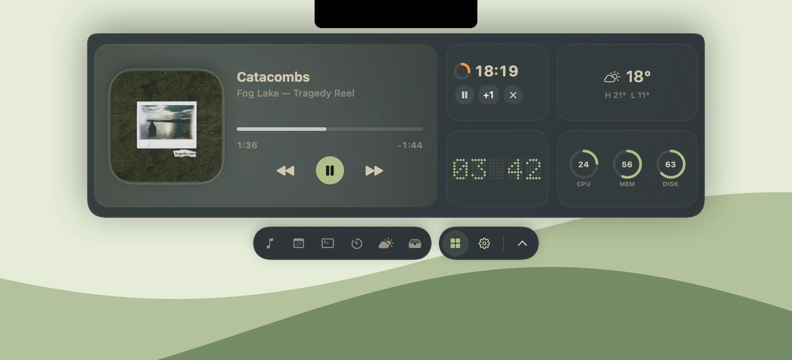
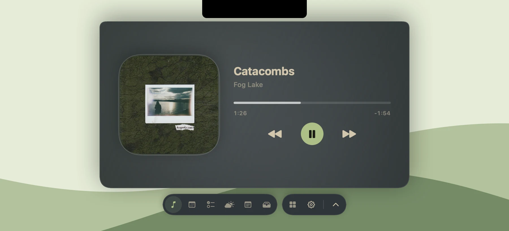
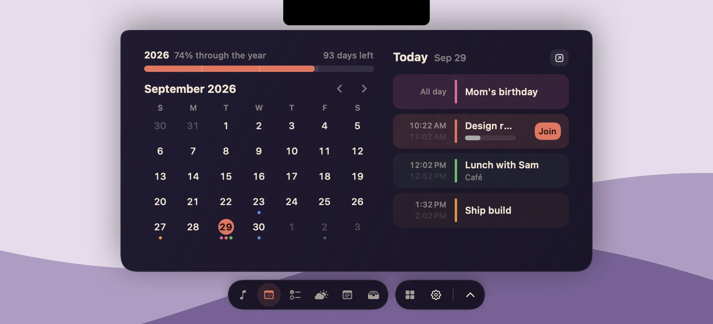
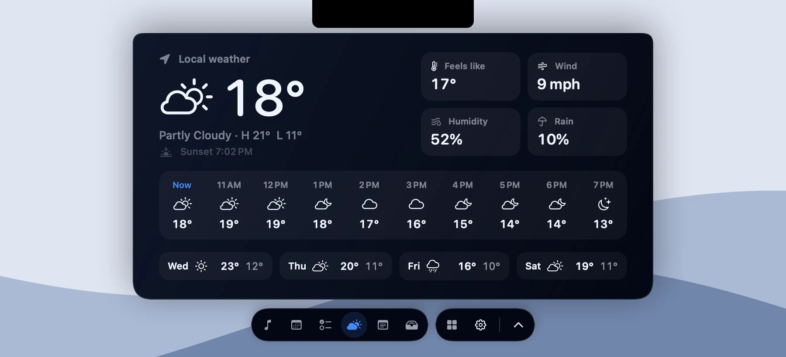
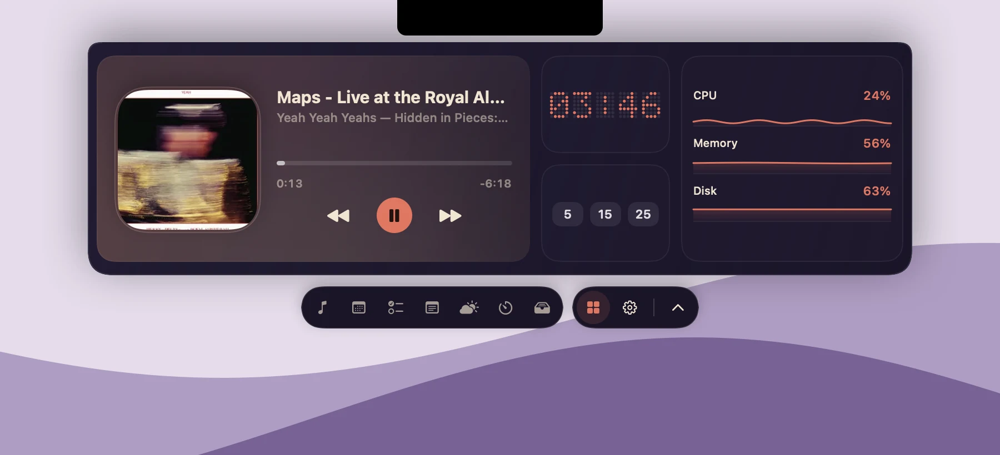
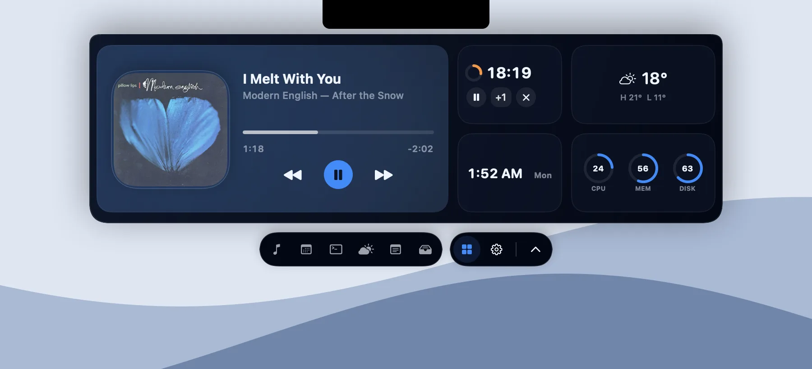
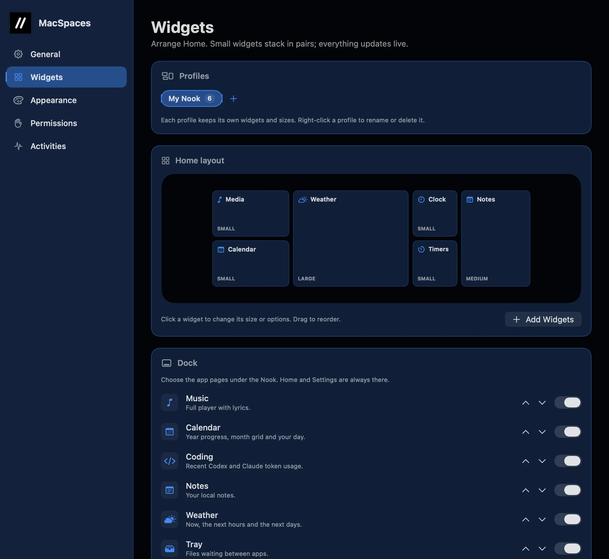

# MacSpaces

**Music, little tasks, and files. Right at your notch.**

[Website & demo](https://zlichtman.com/open-source#macspaces) · [Releases](https://github.com/zlichtman/MacSpaces/releases) · [Report an issue](https://github.com/zlichtman/MacSpaces/issues)



MacSpaces is a free, native menu-bar app that turns the notch into a small
workspace. Move the pointer to the notch to open the **Nook**: change the song,
join your next call, start a timer, jot a note or park a file. Move away, and it
tucks back in. Displays without a camera notch get a small synthetic one.

## Download

**MacSpaces 2.47** is the current release, for macOS 15 or later on Apple silicon
and Intel. It's signed and notarized.

- [Download MacSpaces 2.47](https://github.com/zlichtman/MacSpaces/releases/download/v2.47/MacSpaces.dmg), open the disk image and drag **MacSpaces** into **Applications**.
- Or use Homebrew: `brew install --cask zlichtman/tap/macspaces`. You don't need `brew tap` first; installing by the full name adds [the tap](https://github.com/zlichtman/homebrew-tap) for you.

MacSpaces runs in the menu bar, with no Dock icon or window. After installing, open
it once:

```sh
open -a MacSpaces
```

MacSpaces updates itself: it downloads each new version and asks before restarting.

## What's new in 2.x

**A dock under the Nook.** The Nook hangs just below the notch, and a separate dock
under it opens full pages:

- **Music:** the cover beside the title, lyrics in your accent colour, a slim seek bar and big controls, tinted by the album art.
- **Calendar:** how far through the year you are, a month grid with coloured event dots, and your day with Join buttons.
- **Weather:** now, the next ten hours and the next four days, with feels-like, wind, humidity and rain.
- **Reminders, Notes, Timers, Clipboard, System and Tray.**

Choose which pages appear, and their order, in **Settings → Widgets → Dock**.


| | |
| --- | --- |
|  |  |
| **Music** in Everforest, with Catacombs by Fog Lake | **Calendar** in KemoSabe |



**Widgets in three sizes.** Every Home widget can be Small, Medium or Large.
Small widgets next to each other share a column, so you decide which ones pair
up. Right-click a widget and choose **Size**, or use **Settings → Widgets**.

| | |
| --- | --- |
|  |  |

**Widgets that do more.**

- **Calendar:** your current or next event, with a **Join** button for Zoom, Meet, Teams and other video calls.
- **Reminders:** check them off right in the tile.
- **Timer:** custom lengths, pause and +1 minute. **Focus timer:** your own focus and break lengths.
- **Clipboard:** click a recent clip to copy it again.
- **Notes:** your latest notes, and a one-click New.
- **Weather:** a four-day forecast on Large, in °C or °F.
- **Clock:** 24-hour time, seconds, and a second time zone.
- **Keep Awake:** one tap, for 15 minutes, an hour, two hours, or until you stop it.
- **Quick Actions:** labelled buttons, now with Lock and Display off.
- **Messages:** reply to messages from the Nook.
- **Battery:** time left or until full, battery health, cycle count and the charger's wattage.

**Sound bars in the notch.** While music plays, the closed notch shows moving bars
in your theme's colours. They stay still with Reduce Motion.

**A low-battery warning for coding agents.** Turn on **System → Warn at 20%** and,
when your Mac is on battery at 20% or below, running Claude Code and Codex sessions
are told to save and commit their work and hold off on long jobs. MacSpaces adds one
hook to `~/.claude/settings.json` and `~/.codex/hooks.json` (keeping a backup of your
original), and turning the switch off removes it.

**Themes.** Fifty themes in five drawers: **Core** (the MacSpaces app themes),
**Terminal** (classic editor palettes such as Dracula, Nord and Catppuccin, plus
Karma and **Custom**, where you pick your own colours), **Nature** (petals drifting
down in Blossom, rain in Monsoon, lightning in Thunderstorm, fireflies, falling
snow and leaves), **Live** (a rainbow keyboard wave, a neon Synthwave grid, Lava,
Code Rain, Warp and more) and **Minimal**. Effects move only while the Nook is
open and stay still with Reduce Motion; turn them off in **Settings → Appearance**.

**Calendar credit.** The year progress bar and month grid follow Aaron Lichtman's
DayDrop menu-bar calendar.

**Settings that show what you'll get.** **Settings → Widgets** draws your Home layout
to scale, with each widget's size and options. **Settings → Permissions** lists the
widgets that use each permission. Settings fits any window size, including tiled
windows, with an icon sidebar when it's narrow.



## Privacy

MacSpaces has no account and no analytics. A widget asks for access only when you
add it: Camera for Mirror, Location for Weather (with an approximate IP fallback),
Calendars and Reminders for their widgets, Bluetooth for Battery, Automation for
media details, Quick Actions and Messages, and Full Disk Access only if you turn on
incoming Messages.

Clipboard history stays in memory unless you choose to keep it, and copies that
password managers mark as concealed or transient are never recorded. The app
contacts only the services its features use: Open-Meteo and ipapi.co for weather,
LRCLIB and lyrics.ovh for lyrics, and GitHub for updates.

## Build from source

Install Xcode 26 or later and [XcodeGen](https://github.com/yonaskolb/XcodeGen), then run:

```sh
git clone https://github.com/zlichtman/MacSpaces.git
cd MacSpaces
make
```

That builds 2.47. The
[engineering guide](AGENTS.md) covers architecture, checks and releases.

## Contribute

[Open an issue](https://github.com/zlichtman/MacSpaces/issues) with your macOS
version, MacSpaces version (**Settings → General**) and the steps to reproduce a
problem. Pull requests are welcome. MacSpaces is free and open source under the
[MIT license](LICENSE).
