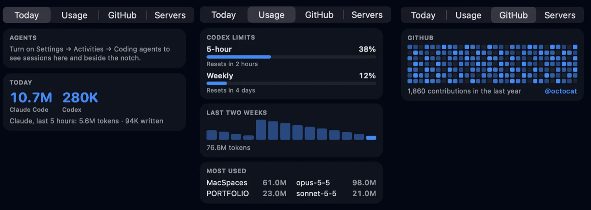
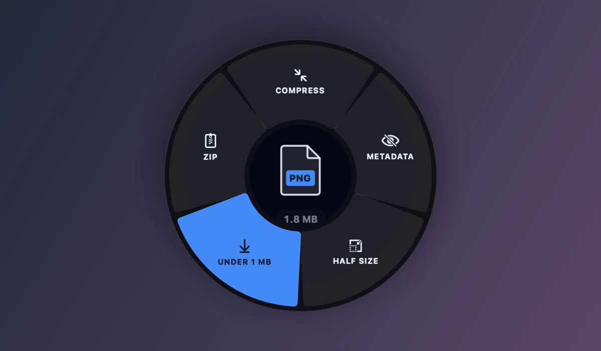
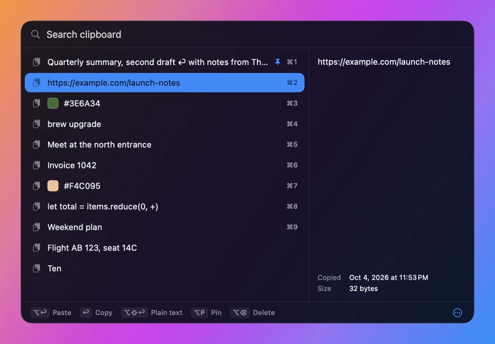

# MacSpaces

**Music, little tasks, and files. Right at your notch.**

[Website & demo](https://zlichtman.com/open-source#macspaces) · [Releases](https://github.com/zlichtman/MacSpaces/releases) · [Report an issue](https://github.com/zlichtman/MacSpaces/issues)


MacSpaces is a free, native menu-bar app that turns the notch into a small
workspace. Move the pointer to the notch to open the **Nook**: change the song,
join your next call, start a timer, jot a note or park a file. Move away, and it
tucks back in. Displays without a camera notch get a small synthetic one.

## Download

**MacSpaces 2.86** is the current release, for macOS 15 or later on Apple silicon
and Intel. It's signed and notarized.

- [Download MacSpaces 2.86](https://github.com/zlichtman/MacSpaces/releases/download/v2.86/MacSpaces.dmg), open the disk image and drag **MacSpaces** into **Applications**.
- Or use Homebrew: `brew install --cask zlichtman/tap/macspaces`. You don't need `brew tap` first; installing by the full name adds [the tap](https://github.com/zlichtman/homebrew-tap) for you.

MacSpaces runs in the menu bar, with no Dock icon or window. After installing, open
it once:

```sh
open -a MacSpaces
```

MacSpaces updates itself: it downloads each new version and asks before restarting.

## What's inside

**A dock under the Nook.** The Nook hangs just below the notch, and a separate dock
under it opens full pages:

- **Music:** the cover beside the title, a slim seek bar and big controls, tinted by the album art, with lyrics in sync in one of six styles: **Classic**, **Poster** (the line's biggest word as a headline), **Choreography** (words step in one by one), **Stickers** (Poster, with a little animated scene when a line mentions something: over ninety, all 3D in their own colours, chosen by what the line is about: every word votes, and words in no list are matched by meaning on your Mac (so "bouquet" brings flowers and "paper planes" a plane): a heart that beats or cracks and breaks apart, a spinning 3D globe, a pin dropping on a map, a coin flipping, a camera flash, steaming coffee, a key turning, a rainbow drawing itself, confetti and more), **Karaoke** (the line fills in as it's sung) or **Typewriter**. Pick one in **Settings → Appearance → Lyrics**. Lyrics work in any language (titles and artists match across scripts and spellings), and words that LRCLIB blanks out are filled back in.
- **Calendar:** how far through the year you are, a month grid with coloured event dots, and your day with Join buttons.
- **Weather:** now, the next ten hours and the next four days, with feels-like, wind, humidity and rain.
- **Terminal:** a shell in the notch for quick commands (type `brew upgrade`, press Return, move on; swipe up for earlier commands), with your coding day one tab away (Shell, Today, Usage, GitHub, Servers): Claude Code and Codex sessions working right now, today's tokens and Claude's last five hours, Codex's plan limits and when they reset, the last two weeks, your most-used projects and models, your GitHub contribution graph, and local dev servers. All of it is read from your own Mac, except the public GitHub calendar.
- **Teleprompter:** your scripts, read just under the camera. It scrolls at your speed or follows your voice (on-device speech recognition only: if your Mac can't recognise your language on the device, it scrolls instead, so audio never leaves your Mac), and it's hidden from screen sharing and recordings. Import text, Markdown, RTF or Word files.
- **Timers:** up to three side by side, each in its own colour; the closed notch shows every running one, soonest first, in the same colours.
- **Shortcuts:** search and run any of your Shortcuts.
- **Music** also has a sound-output menu: switch between speakers, displays and connected devices, or connect AirPods and headphones you've paired before.
- **Reminders, Notes, Clipboard, System, Mirror and Tray.**

Choose which pages appear in **Settings → Widgets → Dock**, and drag them by their handles to set the order.




**Widgets that open into pages.** A Home widget is the small form of its page: hover
and click the corner button, double-click it, or right-click → Open, and the full page
grows out of the tile. The dock still opens any page directly.

**Widgets in three sizes.** Every Home widget can be Small, Medium or Large.
Small widgets next to each other share a column, so you decide which ones pair
up. Right-click a widget and choose **Size**, or use **Settings → Widgets**. With
more than one Home profile, the dock gets a button for each.

| | |
| --- | --- |
|  |  |

**Widgets that do more.**

- **Calendar:** your current or next event, with a **Join** button for Zoom, Meet, Teams and other video calls.
- **Reminders:** check them off right in the tile.
- **Timer:** custom lengths, pause and +1 minute. **Focus timer:** your own focus and break lengths, and a moon button that turns on Do Not Disturb while you focus (after a one-time Shortcuts setup, since macOS lets apps change Focus only that way).
- **Clipboard:** click a recent clip to copy it again, or turn on the paste queue (below).
- **Terminal:** the same quick shell as the Terminal page, right on Home.
- **Notes:** your latest notes, and a one-click New.
- **Weather:** a four-day forecast on Large, in °C or °F.
- **Clock:** your time and up to five places, in a Regular style (the big time with your places beneath) or a Dot style, a dot-matrix board like an airport departures sign where your own city lights up and the minutes flick over like a split-flap display.
- **Keep Awake:** one tap, for 15 minutes, an hour, two hours, or until you stop it.
- **Quick Actions:** labelled buttons, including Lock and Display off.
- **Messages:** new messages slide down under the notch with the sender's name and photo from Contacts; click Reply and type your answer right in the card. The Messages page in the dock is an inbox: your conversations, the open thread as bubbles with their reactions, photos and files, and a reply bar, updating as messages arrive. Right-click a conversation to open, hide or delete it.
- **Battery:** time left or until full, battery health, cycle count and the charger's wattage.
- **Calculator:** sums, units and currencies as you type (`15% of 80`, `5 km in mi`, `100 usd to eur`); click the answer to copy it.
- **Dev servers:** your local servers by port and project, to open in the browser or stop.

**File Converter.** Drag a file and hold **Shift**: a wheel of formats appears around
the pointer. Drop on one and a converted copy is saved beside the original. Hold
**Option-Shift** for tools instead: compress, remove metadata, resize, extract audio,
make a GIF or a snapshot, shrink an image to **under 1 MB** (for GitHub or email), split or merge PDFs, zip and unzip. It covers images, PDFs,
documents, video and audio, several files at once, and nothing leaves your Mac.
Turn it on or off from the menu bar or **Settings → General**.



**File baskets.** Choose **File Baskets** in the menu bar for a little frosted circle
you can park anywhere, say beside the Dock. Drop files on it, click to open it, drag
to move it; it folds back to the same spot. Your baskets also appear on the Nook's
Tray page. The Tray and baskets can AirDrop one file or all of them. Right-click one to remove it; the files themselves stay where they are.

**Clipboard history anywhere.** Press **⇧⌘C** in any app for a searchable list of
everything you've copied, at the pointer. It works from the keyboard: type to search
(exact, fuzzy or regular expression), ↑↓ to choose (⇧ for several), ↩ to copy, ⌥↩ to
paste straight into the app you were in, ⌥⇧↩ to paste as plain text, ⌘1–9 to copy and
⌥1–9 to paste the first nine, ⌥P to pin, ⌥⌫ to delete. A preview shows the whole clip,
the app it came from and when (and how often) you copied it, with image thumbnails
and colour swatches; text inside images is recognised (on your Mac) so screenshots are
searchable too. Narrow the list with `@image`, `@link`, `@file`, `@color`, `@pinned`,
`@snippet`, `@` and an app's name, or `#` and a collection. Pinned clips get their own
keys (⌃A, ⌃B…). Right-click any clip to copy it as UPPERCASE, lowercase, Title Case or
plain text, pin it, or file it in a collection; drag clips straight into other apps.
Write **snippets** for text you paste often, and **pick a colour** from anywhere on
screen. Pins and snippets are kept after quitting; clips you haven't used can delete
themselves after 1, 7 or 30 days. **Settings → Clipboard** sets the shortcut, history
size (up to 1,000), sorting, pins on top or bottom, pausing, and what's ignored: apps,
patterns and clipboard formats. **Switching from Maccy?** Import its history, pins
included, in one click.



**Paste queue.** Turn it on with the list button on the Clipboard page or widget,
copy several things, then press ⌘V again and again: each paste is the next clip, in
the order you copied them or newest first. The closed notch shows how many are left
(turn that count off in **Settings → Activities**).

**More in the closed notch.** A video meeting counts down from ten minutes before it
starts. Turn on **Activities → Coding agents** and Claude Code and Codex show beside the
notch as the app they run in and a small turning globe while they work (a "!" when one
needs you, a check when it's done); the Terminal page's Agents tab lists every session with its prompt,
time and steps, and clicking one takes you to its app (MacSpaces adds one silent hook,
keeping your own).

**Notifications through the notch.** With the Messages page in your dock, a new message
opens the Nook right on that conversation; with the Terminal page, a coding agent that
needs you opens its Agents tab. Either closes again after a few seconds unless you move
in. Anything else (and those, when their page isn't in the dock or you're using the
Nook) slides down under the camera as a card, sized to what it says. Cards never
appear in screen sharing or recordings, or while your Mac is locked
(**Settings → Activities → Notifications**).

**Screenshots land in the Tray.** Turn it on in **Settings → General**: each new
screenshot shows beside the notch for a moment (or not: **Settings → Activities → New
screenshot in Tray**) and waits in the Tray, ready to drag, AirDrop, copy, or **Copy Text**.

**Hide in apps.** Choose apps, such as a game or a presentation, in front of which
the Nook steps away entirely (**Settings → General**).

**Sound bars in the notch.** While music plays, the closed notch shows moving bars
in your theme's colours. They stay still with Reduce Motion.

**Out of the way.** Hovering doesn't open the Nook over Mission Control, and an
open Nook steps aside when Mission Control appears.

**A low-battery warning for coding agents.** Turn on **System → Warn at 20%** and,
when your Mac is on battery at 20% or below, running Claude Code and Codex sessions
are told to save and commit their work and hold off on long jobs. MacSpaces adds one
hook to `~/.claude/settings.json` and `~/.codex/hooks.json` (keeping a backup of your
original), and turning the switch off removes it.

**Themes.** Sixty themes in eight groups: **Core** (the MacSpaces app themes),
**Terminal** (classic editor palettes such as Nord, Catppuccin and Tokyo Night, single
colours from Ruby to Indigo, and **Custom**, where you pick your own), and six groups of
scenes that move gently behind the Nook: **Bloom** (cherry blossom, sunflowers, a
lavender field, a meadow, lotus on a pond), **Forest** (ferns, moss, bamboo, fireflies,
a moon over the pines), **Earth** (embers, lava, dunes, autumn leaves, red-rock
canyons), **Water** (tides, rain, storms, snow, glacier ice), **Sky** (aurora,
starlight, nebulae, prisms, plasma) and **Tech** (a synthwave grid, circuits, code
rain, warp speed, a rainbow keyboard). Effects move only while the Nook is open and
stay still with Reduce Motion; turn them off in **Settings → Appearance**.

**Calendar credit.** The year progress bar and month grid follow Aaron Lichtman's
DayDrop menu-bar calendar.

**Settings that show what you'll get.** **Settings → Widgets** draws your Home layout
to scale, with each widget's size and options. **Settings → Permissions** lists what
each permission is used for.


## Privacy

MacSpaces has no account and no analytics. A feature asks for access only when you
turn it on: Camera for Mirror, Location for Weather (with an approximate IP fallback),
Calendars and Reminders for their widgets, Bluetooth for Battery, Automation for
media details, Quick Actions and Messages, Accessibility for the paste queue and
pasting from history (to see and send ⌘V), the Microphone and Speech Recognition
only while the teleprompter follows your voice (on your Mac), and Full Disk Access
only if you turn on notifications through the notch.

Clipboard history stays in memory unless you choose to keep it. Anything MacSpaces
saves about you (kept history, pins and snippets, teleprompter scripts) is encrypted
with a key held in your Mac's Secure Enclave (or the login keychain on Macs without
one), so the files are unreadable anywhere else. Copies that
password managers mark as concealed or transient are never recorded, and neither is
text shaped like a credential, such as a private key, an access token, a card number
or a block of `.env` secrets. The paste
queue is never saved, and the notch shows only how many clips are left, never what
they say. The File Converter works entirely on your Mac. The app contacts only the
services its features use: Open-Meteo and ipapi.co for weather, LRCLIB and
lyrics.ovh for lyrics, the European Central Bank (frankfurter.app) for currency rates
when you convert a currency, and GitHub for updates.

## Build from source

Install Xcode 26 or later and [XcodeGen](https://github.com/yonaskolb/XcodeGen), then run:

```sh
git clone https://github.com/zlichtman/MacSpaces.git
cd MacSpaces
make
```

That builds 2.86. The
[engineering guide](AGENTS.md) covers architecture, checks and releases.

### Quick tools

**2.86** adds **Find Action**
(Control–Option–Space; configurable in General), **File Tools**, **Dictation** and
**Meeting Controls** to the menu. Keyboard-opened Nook pages stay pinned until
closed. Tray gains multiple-file selection/drag, Space preview, Undo Remove and
pasting files, text, images or links. General has an opt-in completed-file folder
watcher; File Tools has saved presets and cancellable jobs with per-file results.
Finder Services and Shortcuts actions can stage and process selected files.

The dock groups app pages, controls for the active app, and Settings. Home profiles
appear in the middle bar while Home is active. Music's middle bar shows playlist
order and sound outputs. Spotify queue support is excluded; no developer ID or
sign-in is needed. Hide Pin and Close separately in Settings → Widgets → Dock. Meeting adapters currently support Zoom and a selected
Google Meet tab with English control labels. Dictation starts only on request
and requires on-device recognition. See the release verification in
[the feature audit](Documentation/FEATURE-AUDIT.md) for validation and limits.

Settings has a search field below the app name. Press **⌘F** to find a setting, use the arrow keys and Return to open its section, or Escape to clear the search.

## Contribute

[Open an issue](https://github.com/zlichtman/MacSpaces/issues) with your macOS
version, MacSpaces version (**Settings → General**) and the steps to reproduce a
problem. Pull requests are welcome. MacSpaces is free and open source under the
[MIT license](LICENSE).
