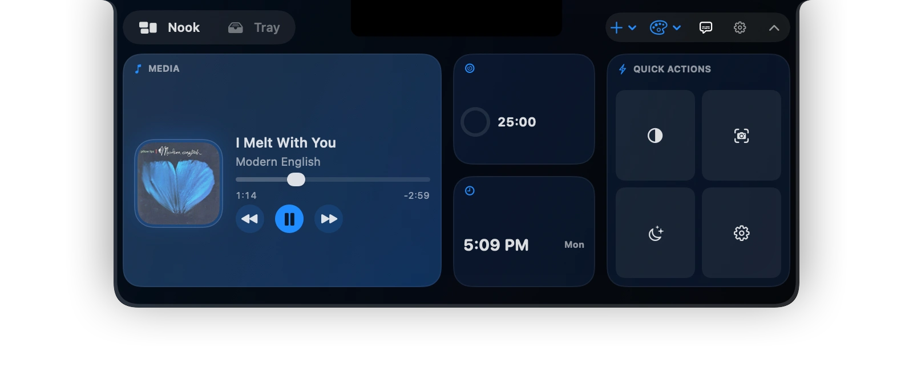
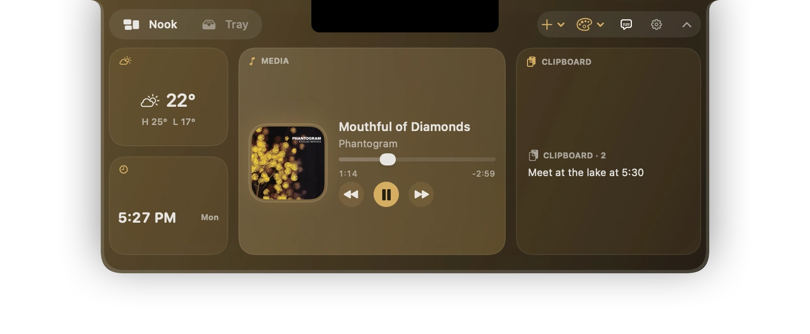
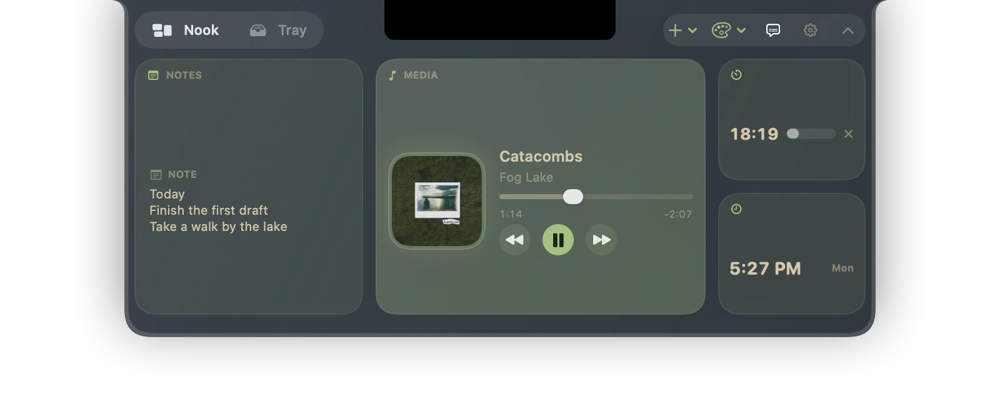
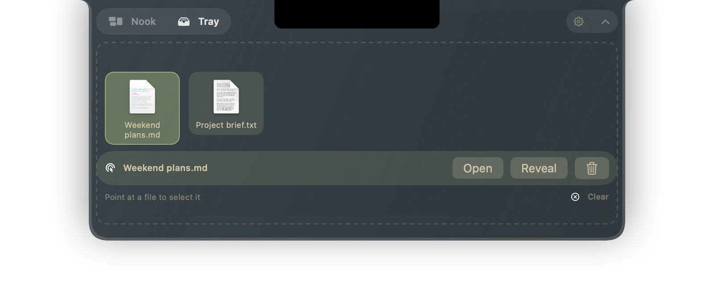
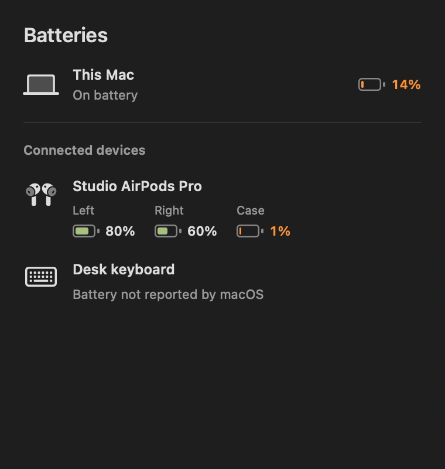

# MacSpaces

A useful little Nook at the top of your Mac. Music, weather, focus timers, notes
and files, in a native panel that opens from the notch.

[Download MacSpaces](https://github.com/zlichtman/MacSpaces/releases/latest/download/MacSpaces.dmg)

macOS 13 or later · Apple silicon and Intel · Signed and notarized · MIT licensed

## Your Nook

| MacSpaces | Custom gold | Everforest |
| --- | --- | --- |
|  |  |  |

- One consistent widget style. Five app themes—MacSpaces, PowderMeet, Heartable, KemoSabe and Tsukumo—plus a separate collection of palettes. System, Light and Dark apply to every built-in theme.
- Widgets fill the available space, including on physical notches that need room
  for the camera. Small and empty profiles keep the add-widget button accessible.
- Music, Weather with hover details, Calendar, Todos, Timer, Pomodoro, Clipboard,
  Notes, Quick Actions, Shortcuts, Battery, Clock and an optional Camera Mirror.
- Drag to reorder widgets; right-click to move or remove them. Create profiles
  for work, listening or a quieter desktop.
- Drop files onto the notch to open the Tray, then drag them into another app. Tray
  tiles show Quick Look previews; right-click to copy, compress, AirDrop or share.
- Compact live activities for music, timers, power and supported system controls.
- Battery details for your Mac and connected devices, including separate earbud
  and case readings when macOS reports them. Plugged in and charging are distinct.
- Settings are organized into General, Widgets, Appearance and Activities.
  Widget access appears with the widgets that need it; version and updates are in General.

Existing profiles and settings are preserved. Legacy style choices use the
modern widget style.

| File Tray | Batteries and devices |
| --- | --- |
|  |  |

Choose a theme once; its preview follows the active appearance. Other palettes include Acid, Carbon, Catppuccin, Cobalt, Dracula, Ember, Everforest, Glass, Gruvbox, Monokai, Nord, One Dark, Solarized, Tidal and Tokyo Night. Saved built-in choices migrate automatically, custom colors are preserved, and the app icon is independent. Appearance offers themes and accessibility controls. The whole settings window follows the palette; Nook size, accents, spacing and borders are handled automatically.

## Install

Open the downloaded disk image and drag MacSpaces to Applications, replacing an
older copy if present. Launch MacSpaces from Applications. Use its menu-bar menu
for settings and updates. A notch is optional: other screens use a synthetic one.

Permissions are requested by the feature that needs them. Camera is only for
Mirror, Location is for Weather, and Calendar/Reminders are for their widgets.
Clipboard history stays in memory and ignores concealed/transient entries from
password managers. There is no account or telemetry.

## Build from source

Install Xcode and [XcodeGen](https://github.com/yonaskolb/XcodeGen), then run
`make` from the repository root. The generated Xcode project and build output
are ignored; `project.yml` defines the project.

Release packaging and publication instructions are in the
[engineering guide](../AGENTS.md#build-and-release). Report reproducible problems
through [GitHub Issues](https://github.com/zlichtman/MacSpaces/issues).
